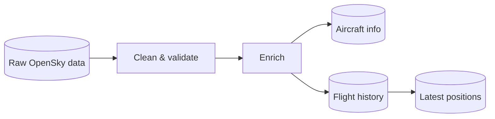
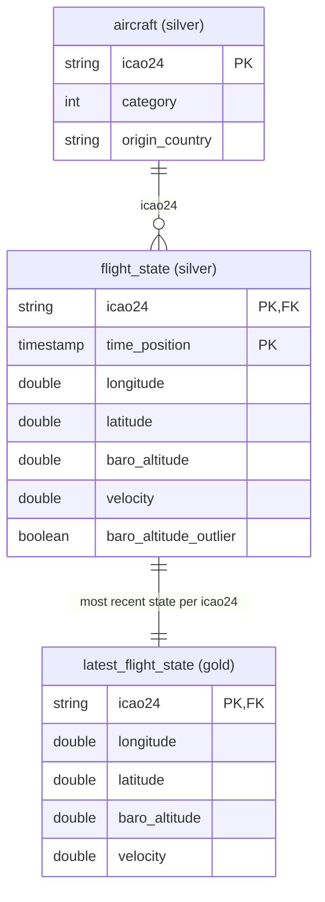

# opensky-pipeline

Tracks near-live aircraft over Belgium (Flanders & Brussels) using OpenSky Network data, built on Databricks.

## Pipeline

## Tables

## Future work
- Include images of airframe by incorporating information from e.g. https://hexdb.io/ or https://airport-data.com
- Improve outlier detection, e.g. velocity bounds relative to aircraft type instead of one fixed range for everything, eventually informed by the actual airframe's known limits via additional lookups/enrichment.
- Creating a gold table to make it easy to see which areas see the most traffic.

## Related

The [Waypoint](https://github.com/co-byte/waypoint) project features a website that currently consumes latest_flight_state.
